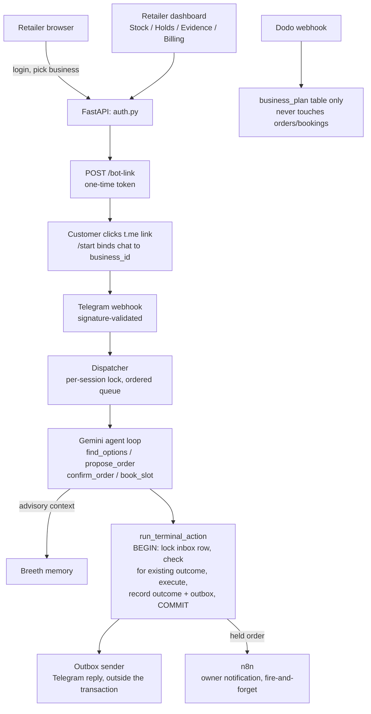

# 🏪 What-A-Bot

### An Agentic Ordering & Booking Assistant for Small Indian Businesses — Telegram-Native, Multi-Tenant, Replay-Safe

[](https://what-a-bot-6ycf.onrender.com/)
[](https://github.com/nikhil-0420/What-A-Bot)
[](https://www.python.org/)
[](https://fastapi.tiangolo.com/)
[](https://react.dev/)
[](https://neon.tech/)
[](https://core.telegram.org/bots/api)

[**Live App**](https://what-a-bot-6ycf.onrender.com/) · [**Repo**](https://github.com/nikhil-0420/What-A-Bot)

> ⚠️ **Honest framing, up front:** this is a working prototype built and tested in one event day, not a merchant-validated product. Every result below is something we actually ran and observed today — nothing here is a projection.

---

## 📌 Overview

Small Indian shop owners field the same repetitive WhatsApp/chat questions all day — "do you have X," "what's it cost for Y," "can I get a mix of brands under this budget" — and either answer manually every time or lose the order to friction.

What-A-Bot is an agent that sits in that conversation and actually does the ordering work:

- A retailer logs into a web dashboard, picks their business, and generates a one-time link that binds a Telegram chat to their shop
- A customer orders directly in that chat — including Hinglish, budget-constrained requests like *"12 A5 ruled copies chahiye, total 600 ke andar, mixed brands chalega"*
- The agent reads **real current inventory**, proposes a validated basket (or a service slot, for booking-type businesses), and only commits **after explicit customer confirmation**
- Every commit is server-validated and atomic: stock never goes negative, a duplicate message never creates a duplicate order, and a stale quote is rejected rather than silently honored

We built one shared transaction-safe engine and ran three different business types on top of it, to show the pattern generalizes rather than being hardcoded to one shop.

**Architected for WhatsApp; demoed on Telegram.** The backend and database design were built against the WhatsApp Business Cloud API. During setup, the team's WhatsApp Business Account was locked by Meta's automated new-account review (a documented, common occurrence, not a code issue) with no reliable unlock time before the event. We swapped the channel layer to the Telegram Bot API — a same-day, two-file change (`webhook.py`, `sender.py`) — while every piece of the actual order/booking logic, the transaction pattern, and the schema stayed untouched. The channel is provably swappable; WhatsApp readiness is architectural, not demonstrated live today.

---

## 🖥️ What's in the app

- **Retailer dashboard** — login, a business picker scoped to only the businesses that owner actually owns, a one-time Telegram bot-link generator, stock & catalog view, held-order approve/reject queue, an evidence panel showing real tool traces, and a software-billing page
- **Customer-facing Telegram bot** — the actual ordering/booking conversation, per business
- **Three businesses on one engine**:
  | Business | Type | What it demonstrates |
  |---|---|---|
  | Sharma Stationery | Retail | The flagship flow — Hinglish, budget/quantity/ruling/size constraints, mixed-brand baskets |
  | Daily Fresh Supermarket | Retail | The same engine on a simpler fixed catalog |
  | UrbanFix Home Services | Service booking | Slot-based capacity instead of SKU stock, same CAS-safe commit pattern |

---

## ✨ Features

| Feature | Description |
| --- | --- |
| 🤖 **Gemini tool-calling agent** | Reads real catalog/service data per business, selects `find_options` → `propose_order`/`book_slot` → `confirm_order`, never invents stock or price |
| 🔒 **Atomic, replay-safe commits** | Every terminal action runs one transaction: lock → check for an existing outcome (idempotent on retry) → execute → record outcome + reply, in that order |
| 🧮 **Server-validated baskets** | Quantity, budget, size/ruling, brand-mixing permission, and live stock/price are all re-checked server-side against the customer's actual request — never trusted from the model's restated version |
| 🏢 **Multi-tenant by construction** | `business_id` is resolved once at bot-link time and carried by the session — never re-derived from request context, never a global mutable value |
| 🧠 **Breeth memory** | Persistent context across a customer's conversation, kept strictly advisory — DB state (stock, price, confirmation status) always overrides memory, never the reverse |
| 🎙️ **ElevenLabs voice input** | Telegram voice notes transcribed and routed through the same validated order flow as typed text |
| 🔔 **n8n owner notification** | A held (above-threshold) order fires a best-effort, fire-and-forget Telegram ping to the owner — notification failure never blocks or changes the actual order outcome |
| 💳 **Dodo software billing** | Retailer-side subscription billing only, fully isolated from customer orders — a payment webhook can never mutate an order or booking row |
| 🧾 **Evidence panel** | Normalized constraints, the actual candidate rows the agent saw, the validation result, and stock/slot before-after — real tool events, never a claimed "reasoning trace" |
| ☁️ **One Render service, full stack** | FastAPI serves the built React app from the same origin — no separate frontend host, no CORS surface to manage |

---

## 🏗️ Tech Stack

**Agent / AI**
- Google Gemini — tool-calling loop for order/booking decisions
- Breeth — cross-conversation agentic memory
- ElevenLabs — speech-to-text for Telegram voice notes

**Backend**
- Python 3.14 · FastAPI · Uvicorn
- Neon (pooled Postgres) via `psycopg`
- Telegram Bot API — webhook intake + outbound send, HMAC-validated via a shared secret header
- `httpx` for outbound integration calls (n8n, Dodo, Telegram)

**Frontend**
- React + TypeScript + Vite, served as static assets from the FastAPI app

**Payments / Ops**
- Dodo Payments (test mode) — retailer billing only
- n8n — owner notification workflow
- Render — single Web Service, GitHub-connected auto-deploy on every push to `main`

---

## 📐 Architecture



---

## 📊 What's actually been verified

**Automated test suite** — run against the real schema and transaction logic:
```
27 passed, 3 warnings
```
Covers: duplicate-input replay (one outcome, not two), crash-before-commit recovery, stale-quote rejection after a correction, two orders competing for the same stock (never negative, loser gets a clean rejection, not a partial invoice), wrong-tenant/wrong-customer order ID rejection, hold approve/reject idempotency, SQL-injection-safe interval parameterization, and the exhaustive-enumeration check against the flagship fixture catalog.

**Confirmed live, end-to-end, on the deployed Render URL (not just locally):**
- Real Telegram message → real webhook → real DB rows (`inbox` completed, `message_outcomes` recorded, `outbox` sent) → real reply delivered to a real phone
- Real owner login → real session → business list correctly scoped to that owner's memberships
- A freshly generated bot-link deep link resolves to the real bot and binds a real chat on `/start`
- Illegal order-state transitions and edits to confirmed-order fields are rejected by a database trigger, not just application code

**Known gaps, stated plainly rather than hidden:**
- WhatsApp integration is architecturally complete but not demonstrated live today (see framing note above)
- Full three-business, full-feature (voice + memory + billing + notification) single run-through is still being finished as of this writing — individual pieces are verified, the complete combined demo path is the last thing being confirmed
- The proxy/usability study described in our original plan may be a labelled developer self-test rather than external participants, depending on time available
- No aggregate cost tracking across runs yet — per-call behavior is correct, nothing bounds total spend if usage scales up

---

## 🚀 Getting Started

### Prerequisites
- Python 3.11+
- Node.js 18+
- A Neon (or any Postgres) database
- A Telegram bot token (via [@BotFather](https://t.me/BotFather))
- API keys for Gemini, Breeth, and ElevenLabs (voice/memory features are optional at runtime — the core order flow works without them)

### 1. Clone and install
```powershell
git clone https://github.com/nikhil-0420/What-A-Bot.git
cd What-A-Bot
python -m venv .venv
.venv\Scripts\Activate.ps1
pip install -r requirements.txt
cd frontend && npm install && cd ..
```

### 2. Configure environment
```powershell
copy .env.example .env
```
Fill in: `DATABASE_URL`, `TELEGRAM_BOT_TOKEN`, `TELEGRAM_WEBHOOK_SECRET`, `JWT_SECRET`, `GEMINI_API_KEY`, `GEMINI_MODEL`, `BREETH_API_KEY`, `ELEVENLABS_API_KEY`, `N8N_WEBHOOK_URL`, `N8N_SHARED_SECRET`, `DODO_API_KEY`, `DODO_WEBHOOK_SECRET`.

### 3. Apply the schema
```powershell
psql $env:DATABASE_URL -f migrations/001_init.sql
psql $env:DATABASE_URL -f migrations/002_multi_business.sql
```

### 4. Build the frontend and run
```powershell
cd frontend && npm run build && cd ..
uvicorn app.main:app --host 0.0.0.0 --port 8000
```
Open `http://localhost:8000` — the FastAPI app serves the built frontend from the same origin.

### Run the test suite
```powershell
pytest tests/test_team_lead_foundation.py tests/test_fixture_enumeration.py tests/test_verification_checklist.py tests/test_language_cases.py -v
```

---

## 📂 Project Structure

```text
emberground/  (repo: What-A-Bot)
├── app/
│   ├── main.py              # FastAPI entrypoint, static frontend serving, lifespan wiring
│   ├── config.py             # env loading, single source of truth
│   ├── db.py                 # Neon pooled connection
│   ├── auth.py                # owner login/session
│   ├── bot_link.py            # one-time Telegram bind tokens
│   ├── webhook.py             # Telegram inbound, signature-validated
│   ├── dispatcher.py          # per-session ordered processing, retry/backoff
│   ├── sender.py              # outbox → Telegram, outside any transaction
│   ├── recovery.py            # startup recovery for interrupted work
│   ├── transactions.py        # the one terminal-action transaction pattern, reused everywhere
│   ├── holds.py                # above-threshold hold flow
│   ├── n8n.py                  # owner notification
│   ├── model_agent.py          # Gemini tool-calling loop
│   ├── voice.py                # ElevenLabs transcription
│   ├── memory/breeth_adapter.py
│   ├── billing/dodo.py         # isolated from order/booking state
│   ├── tools/                  # find_options, propose_order, confirm_order, book_slot, answer_faq, finish_reply
│   ├── owner_page/              # stock, holds routes
│   └── evidence_panel/
├── migrations/
│   ├── 001_init.sql
│   └── 002_multi_business.sql  # owners, bot-link tokens, services/slots/bookings, billing
├── frontend/
│   └── src/
│       ├── api/client.ts       # shared typed API client
│       └── pages/              # Login, Register, BusinessPicker, BotLink, Stock, Holds, Evidence, Billing
├── tests/
│   ├── test_team_lead_foundation.py
│   ├── test_fixture_enumeration.py
│   ├── test_verification_checklist.py
│   └── test_language_cases.py
└── docs/
    ├── CONTRACTS.md             # frozen API/schema contract
    ├── OWNERSHIP.md              # file ownership across the team
    └── DEMO_RUNBOOK.md
```

---

## 🔬 Methodology Highlights

1. **One transaction pattern, reused everywhere** — retail confirm, booking confirm, and owner hold-approval all go through the same lock → check-outcome → execute → record pattern, so replay-safety is proven once and inherited, not re-implemented per feature
2. **Server never trusts the model's restated constraints** — `propose_order` and `book_slot` resolve the customer's original request from server-stored state, not from what the model says it remembers
3. **Memory is advisory, database is authoritative** — Breeth can inform tone and context; it can never override a real stock count or an already-confirmed order
4. **Channel-agnostic by design, proven by necessity** — the WhatsApp→Telegram swap under real time pressure is itself evidence the core architecture doesn't depend on one messaging provider
5. **Honest evidence over polish** — every claim in this README is something we ran today; where we didn't finish verifying something, it's listed as a known gap, not quietly omitted

---

## 🔮 Known Limitations

- WhatsApp is architecturally supported but not the channel demonstrated live (Meta account lock, see framing note)
- The agent's basket/slot selection is a live model call — correct on everything we tested, but not formally guaranteed on inputs outside our test cases
- Breeth, ElevenLabs, and Dodo are real integrations, each independently tested; a single run touching all of them together is the last thing being confirmed before the final demo
- No merchant pilot yet — all evidence is from our own testing and, time permitting, a small proxy exercise, not from a real shop owner's customers
- Single Render worker process — deliberate for today's scope, not a production throughput claim

---

## 👥 Team

Built in one day for EmberGround AI Hackathon 2026, Startup Park Bengaluru — Track: **The Agentic Business**.

| Member | Area |
|---|---|
| **Nikhil** ([GitHub](https://github.com/nikhil-0420)) | Team lead — core pipeline, auth, tenant integrity, bot-link, n8n, integration |
| **Sam** | Retail & booking transaction engine — the CAS-safe, replay-safe commit logic |
| **Shahana** | Gemini agent loop, Breeth memory, ElevenLabs voice |
| **Ashraf** | Frontend foundation — login, business picker, bot-link UI, shared API client |
| **Jagdeep** | Owner operations UI — stock, holds, evidence, billing, Dodo integration |

---

**⭐ If you found this project interesting, consider giving it a star.**
